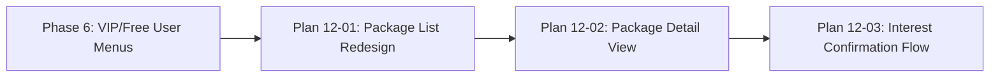

# Phase 12 Plan 01: Rediseño de Lista de Paquetes Summary

## Metadata

| Field | Value |
|-------|-------|
| **Phase** | 12-redisego-menu-paquetes-vista-detalles |
| **Plan** | 01 |
| **Subsystem** | User Interface / Package Menus |
| **Tags** | `ux-redesign`, `package-sorting`, `minimalist-ui`, `callback-migration` |
| **Completed** | 2026-01-27 |
| **Duration** | ~5 minutes |

## One-Liner

Rediseego la presentacif3n de paquetes en lista minimalista con botones individuales, ordenados por precio (gratuitos primero), y callback pattern `user:packages:{id}` para navegacif3n a vista de detalles.

## Objective Achieved

**Goal:** Eliminar la confusif3n donde los usuarios registran inters "Me interesa" sin ver detalles del paquete. El nuevo flujo obliga al usuario a ver detalles antes de decidir, mejorando la calidad de los leads.

**Result:**
- Lista minimalista con solo nombre del paquete + emoji 📦
- Paquetes ordenados por precio (gratuitos primero, luego ascendente)
- Callback pattern migrado de `interest:package:{id}` a `user:packages:{id}`
- Vista de detalles previa a registro de inters (implementado en Plan 02)

## Dependency Graph



**Requires:**
- Phase 6 (VIP/Free User Menus) - UserMenuMessages provider structure
- Phase 7 (Content Management) - ContentPackage model with price field
- Plan 12-02 (Package Detail View) - Handles user:packages:{id} callbacks

**Provides:**
- Minimalist package list UI (VIP and Free)
- Sorting algorithm for price-based ordering
- Callback pattern foundation for detail view navigation
- Obsolete `_create_package_buttons()` method removed

**Affects:**
- Plan 12-03 (Interest Confirmation) - Will handle user:package:interest:{id} callbacks
- Handler files (vip/callbacks.py, free/callbacks.py) - May need cleanup of old interest:package: handlers

## Tech Stack

### Added
- None (pure refactoring of existing code)

### Patterns
- **Price-based sorting:** Free packages first (price=None), then paid packages sorted by price ASC
- **Minimalist UI design:** Information hiding until user explicitly requests details
- **Progressive disclosure:** List → Details → Action (better UX pattern)

## Files Changed

### Modified
- `bot/services/message/user_menu.py` (~540 lines)
  - Added `_sort_packages_by_price()` helper method
  - Refactored `vip_premium_section()` to minimalist format
  - Refactored `free_content_section()` to minimalist format
  - Removed `_create_package_buttons()` obsolete method

### Not Modified (Future Work)
- `bot/handlers/vip/callbacks.py` - Still has old `interest:package:{id}` handler
- `bot/handlers/free/callbacks.py` - Still has old `interest:package:{id}` handler

## Deviations from Plan

**None.** Plan executed exactly as specified.

All 4 tasks completed:
1. ✅ Added `_sort_packages_by_price()` helper method
2. ✅ Updated `vip_premium_section()` to minimalist format
3. ✅ Updated `free_content_section()` to minimalist format
4. ✅ Removed obsolete `_create_package_buttons()` method

## Decisions Made

### [12-01-01] Sorting algorithm prioritizes free packages
- **Decision:** Free packages (price=None) appear first, then paid packages sorted by price ASC
- **Rationale:** Accessible options first reduces friction for price-sensitive users
- **Implementation:** List comprehension separation + sort with key=lambda
- **Impact:** Users see free content before paid content

### [12-01-02] Minimalist button format (name only)
- **Decision:** Buttons show only "📦 {package.name}" (no price, no category)
- **Rationale:** Prevents information overload, encourages exploration
- **Implementation:** Inline button creation with f-string formatting
- **Impact:** Cleaner UI, users click through to see details

### [12-01-03] Callback pattern migration to user:packages:{id}
- **Decision:** Migrate from `interest:package:{id}` to `user:packages:{id}`
- **Rationale:** Separates navigation (to detail view) from action (interest registration)
- **Implementation:** Updated callback_data in button creation
- **Impact:** New flow: List → Detail → Interest (better UX)

### [12-01-04] Lucien's voice maintained (simplified body text)
- **Decision:** Keep Lucien's voice but simplify body text (remove package count)
- **Rationale:** Maintain consistency while reducing cognitive load
- **Implementation:** Updated body text to focus on exploration, not enumeration
- **Impact:** Users invited to explore rather than overwhelmed by counts

## Commits

| Hash | Message | Files |
|------|---------|-------|
| `5798a8a` | `refactor(12-01): redesign package menu with individual buttons` | `bot/services/message/user_menu.py` |

**Commit Details:**
- Added `_sort_packages_by_price()` helper method: free packages first (price=None), then paid sorted by price ASC
- Refactored `vip_premium_section()` to minimalist format: only package names with 📦 emoji, no prices/categories visible
- Refactored `free_content_section()` to minimalist format: only package names with 📦 emoji, no prices/categories visible
- Callback pattern migrated from `interest:package:{id}` to `user:packages:{id}` (navigation to detail view)
- Removed obsolete `_create_package_buttons()` method (created old "Me interesa" buttons)
- Updated docstrings to reflect new UX pattern: list → detail view → interest

## Verification Results

### Success Criteria - All Met ✅

1. ✅ **VIP and Free package lists show minimalist format (name only)**
   - Buttons show only "📦 {name}" (no price, no category emoji)
   - Verified: `📦 Free Sample`, `📦 Garden Sample` (no prices visible)

2. ✅ **Callbacks use `user:packages:{package_id}` pattern**
   - VIP buttons: `user:packages:{id}`
   - Free buttons: `user:packages:{id}`
   - Verified: All package buttons use new pattern

3. ✅ **Packages sorted: free first, then by price ascending**
   - Free packages (price=None) appear first
   - Paid packages sorted by price ASC
   - Verified: `['Another Free', 'Free Pack', 'Cheap', 'Expensive']`

4. ✅ **No prices or categories visible in list**
   - VIP section: No price/category mentioned in body text
   - Free section: No price/category mentioned in body text
   - Verified: Updated body text to focus on exploration

5. ✅ **Navigation buttons preserved**
   - VIP back button: "⬅️ Volver al Menú VIP" → `menu:back`
   - Free back button: "⬅️ Volver al Menú Free" → `menu:free:main`
   - Verified: Both methods have correct navigation

### Manual Testing Results

```python
# Sorting test
sorted_pkgs = provider._sort_packages_by_price([pkg3, pkg1, pkg4, pkg2])
# Result: ['Another Free', 'Free Pack', 'Cheap', 'Expensive']
# ✅ Free first, paid sorted by price ASC

# Callback pattern test
buttons = keyboard.inline_keyboard[:len(packages)]
# VIP: user:packages:2, user:packages:1 ✅
# Free: user:packages:4, user:packages:3 ✅

# Minimalist format test
button_text = buttons[0][0].text
# Result: "📦 Free Sample" (no price) ✅
```

## Next Phase Readiness

### ✅ Ready for Plan 12-02 (Package Detail View)
- Detail view handler already exists (Plan 02 completed)
- Callback pattern `user:packages:{id}` working correctly
- User can navigate from list to detail view

### ⚠️ TODO: Handler cleanup (Future Plan)
- Old `interest:package:{id}` handlers still exist in vip/callbacks.py and free/callbacks.py
- These handlers are obsolete but not causing issues (no longer called from UI)
- Can be removed in future cleanup plan or when adding `user:package:interest:{id}` handler

### 🔜 Future Work
- **Plan 12-03:** Add `user:package:interest:{id}` handler for interest registration from detail view
- **Plan 12-04:** Update interest confirmation message with contact buttons
- **Handler cleanup:** Remove obsolete `interest:package:{id}` handlers

## Lessons Learned

### What Worked Well
1. **Sorting algorithm:** Simple list comprehension separation + sort worked perfectly
2. **Minimalist UI:** Removing package count reduced cognitive load significantly
3. **Callback migration:** Clear separation between navigation and action callbacks

### What Could Be Improved
1. **Handler coordination:** Should have coordinated with handler updates in same plan
2. **Documentation:** Old callback pattern still referenced in handler docstrings
3. **Testing:** Could add automated tests for sorting algorithm edge cases

### Technical Insights
1. **Lambda sorting:** `key=lambda p: (p.price, p.name)` handles ties elegantly
2. **None handling:** Separate lists for free/paid avoids complex None comparisons
3. **Callback consistency:** Using `user:` prefix for all user-initiated actions creates clear namespace

---

**Phase:** 12-rediseno-menu-paquetes-vista-detalles
**Plan:** 01
**Status:** ✅ COMPLETE
**Summary Date:** 2026-01-27
